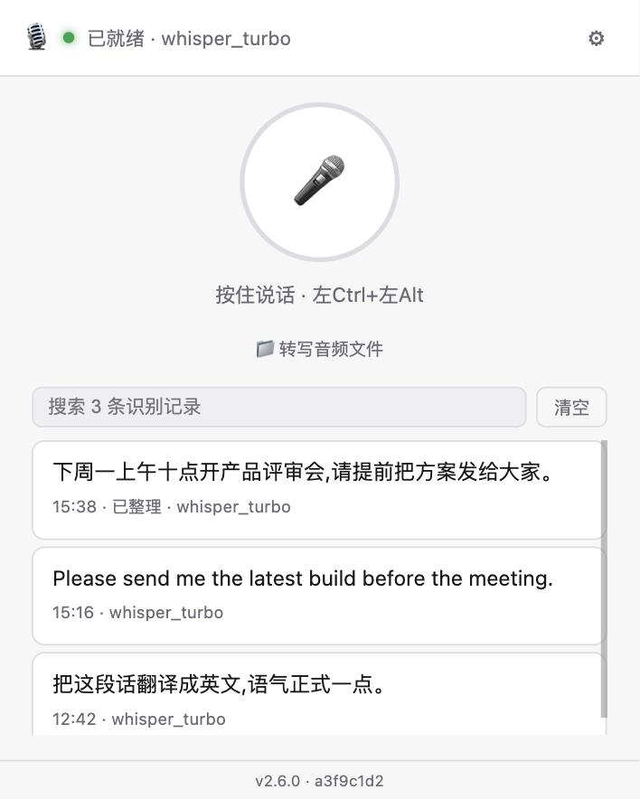
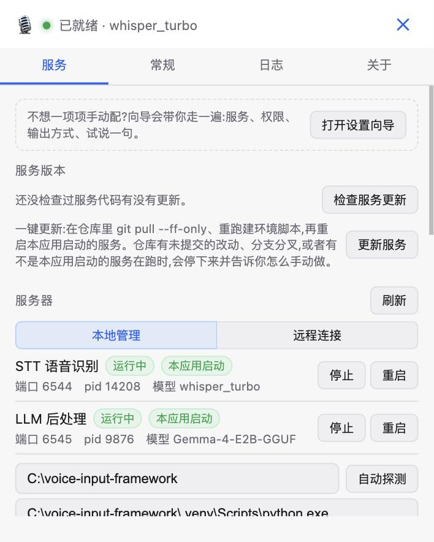
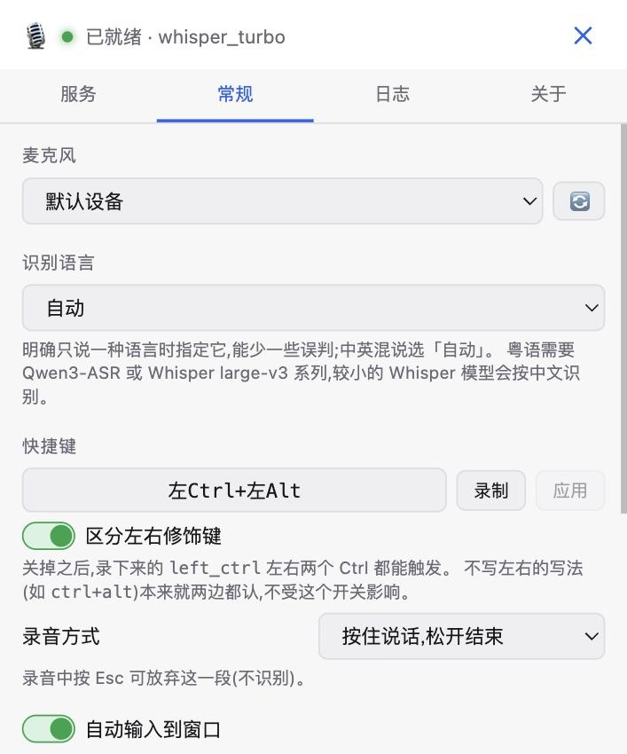
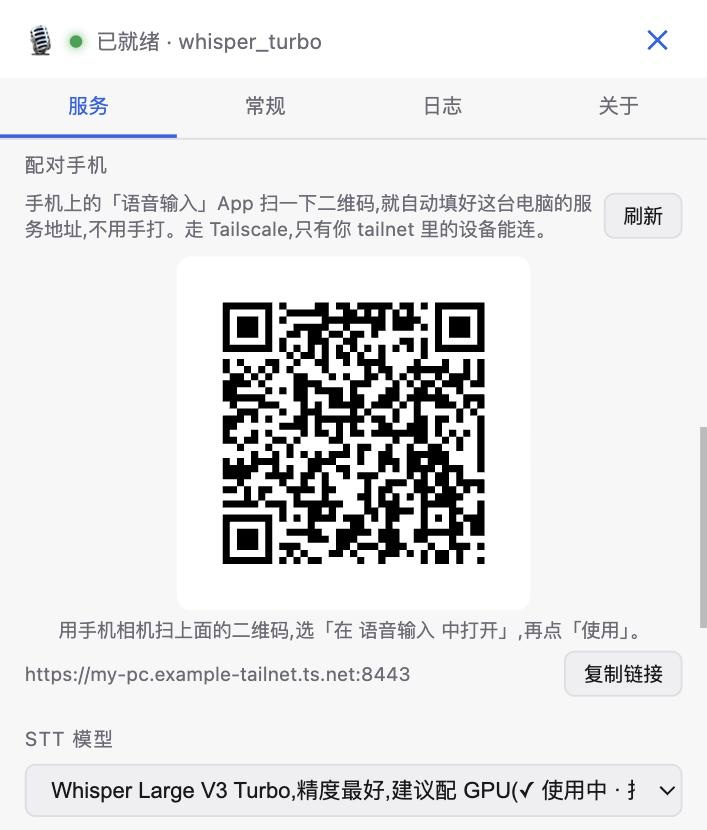
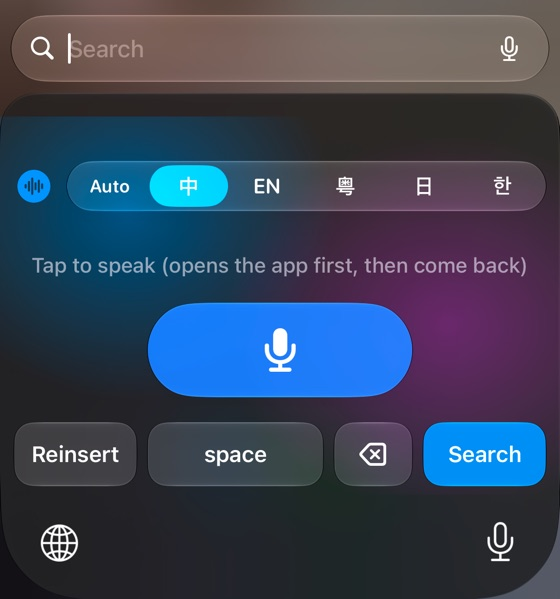
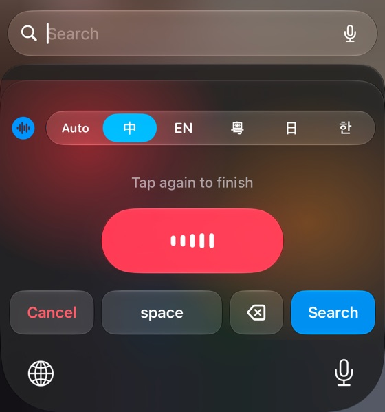

# Voice Input Framework

基于大模型的语音识别框架，支持实时音频采集与离线转写、LLM 后处理。

## ✨ 特性

- 🎤 **实时音频采集**：支持麦克风实时录音，6种采样格式自动适配
- 🚀 **边录边识别**：按下就开始上传，服务端录音期间每攒够约 20–28 秒就先转一段，松手时只剩最后一段（长录音松手后约 1 秒出字；服务端较旧时自动退回松手后一次性上传）
- 🤖 **多模型支持**：
  - **Qwen3-ASR-1.7B** (推荐) - 52种语言/方言，加载快 (~27秒)
  - **Qwen3-ASR-0.6B** - 更快，适合实时场景
  - **Whisper-large-v3** - OpenAI 经典模型
  - **MLX 加速** - Apple Silicon 原生优化
- 🧠 **LLM 后处理** - 自动优化识别结果（去噪、加标点、格式化）
- 🔌 **分离架构**：STT 和 LLM 独立服务，解决 transformers 版本冲突
- 🖥️ **跨平台客户端**：Tauri GUI（Windows/macOS/Linux）；旧的 Python 客户端已不推荐使用，见下文
- 📱 **手机输入法**（初版）：Android 输入法、iOS 键盘，连你电脑上的 STT / LLM 服务；桌面客户端能生成二维码，手机扫一下就填好服务地址，见 [mobile/README.md](mobile/README.md)
- 🔒 **数据不出你的设备**：识别和整理都在你自己的电脑上完成，没有云端后端，见下文「隐私」

## 📸 界面

**桌面客户端**（窗口默认 400×500；截图里的地址、令牌和识别记录都是示例数据）：

| 主界面 | 设置 → 服务 |
|:---:|:---:|
|  |  |
| **设置 → 常规** | **手机直连（局域网）** |
|  |  |
| **配对手机** | |
|  | |

**iOS 键盘**（iOS 26 液态玻璃；顶部选识别语言，点一下说话、再点一下结束）：

| 待机 | 录音中 |
|:---:|:---:|
|  |  |

## 我该看哪份文档

| 我想…… | 看这里 |
|---|---|
| 在电脑上用（装客户端 + 建服务） | 下面「[快速开始](#-快速开始)」 |
| 帮忙测试 Windows / Android，自己搭服务自己连 | [docs/testing.md](docs/testing.md) |
| 在手机上用（Android / iOS） | [mobile/README.md](mobile/README.md) |
| 自己编译 / 改代码 | 下面「构建」「测试」两节，以及 [docs/DEVELOPMENT.md](docs/DEVELOPMENT.md) |
| 报 bug / 提建议 | [Issues](https://github.com/3F3Feng/voice-input-framework/issues/new/choose) |

## 📦 支持的模型

### STT 模型

下表的「注册名」就是 `VIF_STT_MODEL`、设置面板下拉框和 `/models/select` 里用的名字，
唯一来源是 `shared/model_registry.py`。

| 注册名 | 说明 | 内存 | 平台 |
|--------|------|------|------|
| `qwen_asr_mlx_native` | Qwen3-ASR-1.7B MLX 8bit，**推荐**，52 种语言/方言 | ~1GB | Apple Silicon |
| `qwen_asr_mlx_native_small` | Qwen3-ASR-0.6B MLX 4bit，更快 | ~0.5GB | Apple Silicon |
| `whisper_mlx` | MLX Whisper Large V3 | ~3GB | Apple Silicon |
| `whisper_mlx_turbo` | MLX Whisper Large V3 Turbo，快速且准确 | ~2GB | Apple Silicon |
| `whisper_mlx_medium` | MLX Whisper Medium | ~1.5GB | Apple Silicon |
| `whisper_mlx_small` | MLX Whisper Small，最快 | ~0.5GB | Apple Silicon |
| `whisper_tiny` | Whisper Tiny（transformers），最快、精度一般，适合低配 / 纯 CPU | ~0.3GB | 全平台 |
| `whisper_base` | Whisper Base（transformers），纯 CPU 上的推荐起点 | ~0.5GB | 全平台 |
| `whisper_small` | Whisper Small（transformers），速度与精度折中 | ~1GB | 全平台 |
| `whisper_medium` | Whisper Medium（transformers），有独显时适用 | ~2.5GB | 全平台 |
| `whisper_turbo` | Whisper Large V3 Turbo（transformers），精度最好，建议配 GPU | ~3GB | 全平台 |
| `qwen_asr_small` | Qwen3-ASR-0.6B 8 位量化版（llama.cpp），中文和中英混说明显好于 Whisper，显卡 / CPU 都能跑 | ~1.3GB | 全平台（Windows / Linux 的默认） |
| `qwen_asr` | Qwen3-ASR-1.7B 8 位量化版（llama.cpp），中文最准 | ~3GB | 全平台（显存 ≥ 11GB 时的默认） |
| `whisper_cpp_base` / `whisper_cpp_large` | Whisper V3 via whisper.cpp | 1GB / 3GB | 需自行编译 `~/whisper.cpp` 并把模型放到 `~/.cache/whisper/` |

### 按硬件配好的几套

不指定模型时，两个服务按**同一张表**挑（`shared/hardware_plan.py`）：识别模型和后处理模型是配成
一套的，加起来放得进显存，还给桌面留一截。「设置 → 服务 → STT 模型」下面会写明这台机器被分到了哪一套。

| 系统 | 硬件 | 档位 | 语音识别 | LLM 后处理 | 运行环境 |
|------|------|------|----------|------------|----------|
| macOS | Apple 芯片 | 内存 ≥ 16 GB | Qwen3-ASR-1.7B（MLX 8bit） | Gemma-4-E4B（MLX） | MLX / Metal |
| macOS | Apple 芯片 | 内存 < 16 GB | Qwen3-ASR-0.6B（MLX 4bit） | Gemma-4-E2B（MLX） | MLX / Metal |
| Windows / Linux | NVIDIA | 显存 ≥ 11 GB | Qwen3-ASR-1.7B 量化版 | Gemma-4-E4B（显卡） | llama.cpp CUDA |
| Windows / Linux | NVIDIA | 显存 5.5–11 GB | Qwen3-ASR-0.6B 量化版 | Gemma-4-E2B（显卡） | llama.cpp CUDA |
| Windows / Linux | NVIDIA | 显存 2.5–5.5 GB | Qwen3-ASR-0.6B 量化版 | Gemma-4-E2B（CPU） | llama.cpp CUDA |
| Windows / Linux | AMD / Intel Arc | 同上三档，按显存 | 同上 | 同上 | llama.cpp Vulkan |
| 任何系统 | 没有独立显卡 | ≥ 6 线程且内存 ≥ 8 GB | Qwen3-ASR-0.6B 量化版 | Gemma-4-E2B（CPU） | llama.cpp CPU |
| 任何系统 | 没有独立显卡 | 更小的机器 | Whisper Base / Tiny | Gemma-4-E2B（CPU） | PyTorch CPU + llama.cpp CPU |

- 后处理跑在 CPU 上时一句话要等几秒，所以只有 ≥ 12 线程且内存 ≥ 16 GB 的机器默认开着，其余默认关
  （可以自己打开）。「线程」是系统报的逻辑处理器数。
- 显卡看的是 **llama.cpp 认得出什么**：显卡在、但装的是 CPU 版的 llama.cpp（或者驱动不可用）时，
  按没有显卡来选。集成显卡不算。
- 8 GB 的显卡落在第二档（1.3 + 3.8 = 5.1 GB），而不是勉强塞进 1.7B——Windows 的桌面自己要占
  0.5–1.5 GB 显存。想换可以手动选，「设置 → 服务」里会提示模型是不是跑在了 CPU 上。
- 哪些是实测的：Apple 芯片两档、llama.cpp 上的每个模型（本机 Metal 和纯 CPU）、NVIDIA 上 CUDA 版
  能装上并认出显卡（GTX 1070 Ti）。AMD / Intel Arc 的 Vulkan 只在 CI 的软件渲染上跑过；各档的门槛是
  按模型大小算的，不是在每种显卡上量出来的。Intel Mac 没有测过（按「没有独立显卡」处理）。
- `VIF_STT_MODEL` / `VIF_LLM_MODEL` 可以强制指定；在设置里手动切换过的模型会被记住，优先于这张表。

为什么非 Apple 平台用量化版 Qwen3-ASR 而不是 Whisper：同一批中文 / 中英混说录音，`whisper_base`
出繁体字和错字，量化版 Qwen3-ASR-0.6B 和 `whisper_turbo` 一样准、自带标点，而且快得多——本机
显卡上 90 秒录音 2 秒出结果，只给 2 个 CPU 线程也只要 11.5 秒。它和半精度的原版权重比过 12 段
录音：9 段逐字相同，其余 3 段是标点和中英文之间空格的差别；权重小三分之一，识别服务也不再需要
加载 PyTorch。

### LLM 后处理模型

LLM 服务按平台挑推理后端：**Apple Silicon 用 MLX**（依赖默认就装），**Windows / Linux 用
llama.cpp** 跑 GGUF 模型（`setup-env` 默认就会装上 `llama-cpp-python`；更早建的环境里没有时，
界面上的后处理开关会置灰，旁边有「安装 llama.cpp」）。
想在 Mac 上也用 llama.cpp，设 `VIF_LLM_BACKEND=llamacpp` 并 `uv sync --extra llm-cpp`。
两个后端的模型不通用，模型列表只列当前后端的。

MLX 后端（Apple Silicon）：

| 模型 | 内存占用 | 特点 |
|------|----------|------|
| Gemma-4-E4B | ~6.4GB | **默认(内存 ≥16GB)**,Google QAT 4bit;格式整理最好(口述列举 → 编号列表、换话题分段、数字) |
| Gemma-4-E2B | ~4GB | **默认(内存 <16GB)**,Google QAT 4bit;最快,中文、英文、中英混说都稳 |
| Qwen3.5-4B-OptiQ | ~4GB | 旧默认；默认模型加载失败时自动退回它 |
| Qwen3.5-4B-MLX | ~3GB | 同一模型的普通 4bit 量化，内存更省 |
| Qwen3.5-2B-OptiQ / Qwen3-0.6B / Qwen3-1.7B | ~2GB / ~0.5GB / ~1.5GB | 更小，但实测多数句子原样照抄，不推荐 |

llama.cpp 后端（其它平台，4bit 量化，首次使用时下载到 HuggingFace 缓存）：

| 模型 | 下载大小 | 特点 |
|------|----------|------|
| Gemma-4-E4B-GGUF | ~5.2GB | 显存 ≥ 11 GB 时的**默认**；格式整理 18/18，本机 Metal 上中位延迟 0.44 秒 |
| Gemma-4-E2B-GGUF | ~3.4GB | 其余情况的**默认**，Google 官方 QAT q4_0；中文、英文、中英混说都稳 |
| Qwen3.5-2B-GGUF | ~1.3GB | 旧默认；实测多数句子原样照抄，默认模型加载失败时退回它 |
| Qwen3.5-0.8B-GGUF | ~0.5GB | 最快，但填充词和改口常常原样留着 |
| Qwen3.5-4B-GGUF | ~2.7GB | 纯 CPU 上一段长文要等十几秒以上 |

两个后端的默认模型是这样选的：用中文、英文、两种方向的中英混说、改口、夹术语、
「帮我写一首诗」等 8 类输入 × 默认提示词和三个预设共 64 例自动检查，再量延迟和内存。
Gemma-4-E2B 的 QAT 版在 MLX 和 llama.cpp 上都只有 1 例不合格，延迟约为旧默认的一半。

`llama-cpp-python` 要 0.3.25 以上（更早的版本不认 Gemma 4）。`setup-env` 装的是官方
**预编译包**，不需要编译器，并且**有显卡就装显卡版**（默认模型在纯 CPU 上一句话要等好几秒，
CPU 版只是兜底）：

| 显卡 | 装哪个 | 说明 |
|------|--------|------|
| NVIDIA | CUDA 版 | 最快。约 500 MB（Windows）/ 1.8 GB（Linux）。包里不带 CUDA 运行库，用的是 PyTorch CUDA 版带的那份，所以只需要显卡驱动 |
| AMD / Intel Arc | Vulkan 版 | 约 40 MB，只需要显卡驱动；也能在 NVIDIA 上跑，比 CUDA 慢一些 |
| 没有独立显卡 | CPU 版 | 兜底，慢 |

装完脚本会真的加载一次，看 llama.cpp 认不认得出显卡；认不出（驱动太旧、缺运行库）就依次退回
CUDA → Vulkan → CPU，并在最后说清楚落在了哪一个。`--llm-backend cuda|vulkan|cpu`
（PowerShell 是 `-LlmBackend`）可以手动指定，「更新服务」会记住手动的选择；自动选的每次更新都重新
探测，装了新驱动之后能自己升到显卡版。运行时如果模型在显卡上放不下（显存不够），LLM 服务会退回
CPU，并在「设置 → 服务」和 LLM 开关下面提示。

> 显卡版的选择和回退逻辑在 CI 里验证过（Vulkan 版用软件渲染真的跑了一次推理；假装有 N 卡时
> CUDA 版加载不了会退回）。**CUDA 版在真的 NVIDIA 显卡上还没跑过**——有 N 卡的话，装完看一眼
> 「设置 → 服务」里 LLM 那一行有没有「跑在 CPU 上」的提示。

## 🚀 快速开始

分两部分：**客户端**（桌面应用）和**服务端**（跑模型的 Python 服务）。
服务端可以和客户端在同一台机器上，也可以放在另一台有显卡的机器上。

**不想折腾的最短路径**：下载客户端 → 克隆仓库并运行 `scripts/setup-env.sh`（Windows 用
`scripts\setup-env.ps1`）→ 客户端里「设置 → 服务」选「本地管理」→「自动探测」→「启动」→
按住 `Ctrl+Alt` 说话。第一次启动要下载模型，需要一点时间。

### 从 Releases 安装客户端 + 本地建服务端（推荐）

1. 到 [Releases](https://github.com/3F3Feng/voice-input-framework/releases/latest) 下载对应平台的客户端：
   - macOS（Apple Silicon）：`GUI-macOS-<版本>-aarch64.dmg`
   - Windows：`GUI-Windows-<版本>-x64.exe`
   - Linux：`GUI-Linux-<版本>-x64.AppImage` 或 `.deb`

   > macOS 上的发布包没有 Developer ID 签名，浏览器下载后打开可能提示「已损坏」。
   > 文件本身是好的，执行 `xattr -dr com.apple.quarantine "/Applications/Voice Input.app"`
   > 后再打开即可，详见 [docs/macos-signed-build.md](docs/macos-signed-build.md)。
   >
   > Windows 上没有代码签名时会弹 SmartScreen「已保护你的电脑」：点「更多信息」→「仍要运行」。

2. 克隆仓库，一键建服务端环境（见下面「服务端」）。

3. 打开客户端 →「设置 → 服务」选「本地管理」，点「自动探测」找到仓库和
   `.venv` 里的解释器，再点「启动」。也可以勾上「随应用启动」。

### 服务端

```bash
git clone https://github.com/3F3Feng/voice-input-framework.git
cd voice-input-framework

# 一键建环境:探测硬件(Apple Silicon / NVIDIA / AMD / Intel / 纯 CPU),
# 挑对应的 PyTorch 后端,用 uv 装进仓库下的 .venv(没有 uv 会先自动装上)
scripts/setup-env.sh

# 启动 STT 服务 (端口 6544)
uv run python -m services.stt_server

# 启动 LLM 服务 (端口 6545，可选)
uv run python -m services.llm_server
```

Windows 上用 PowerShell 版脚本（参数与 bash 版对应：`-Backend cpu|cuda|xpu`、`-LlmBackend`、`-NoLlm`、`-Dev`；
有 NVIDIA 显卡会自动选 CUDA，否则用 CPU）：

```powershell
cd voice-input-framework
powershell -ExecutionPolicy Bypass -File scripts\setup-env.ps1
uv run python -m services.stt_server
```

- **所有依赖默认都装**：Apple Silicon 上是 MLX；其它平台是 PyTorch 加 llama.cpp（语音识别的量化版
  Qwen3-ASR 和 LLM 后处理都跑在 llama.cpp 上，有显卡装显卡版）。不想装 llama.cpp 可以加 `--no-llm`
  （Windows 上 `-NoLlm`），那样只剩 Whisper 系的识别模型，也没有后处理。
- 自动探测不准时可以手动指定后端：`scripts/setup-env.sh --backend cpu|cuda|rocm|xpu|mlx`。
- 建完环境后可以在客户端「设置 → 服务」里点「环境体检」：逐项检查 Python 版本、关键依赖能否导入、
  加速后端和 uv，有问题会给出修复命令。
- 需要 Python 3.11 或 3.12（`uv` 会自己准备合适的解释器）。
- **不要再用 `pip install -r requirements-stt.txt`**：那份清单无条件装 mlx，而 Linux 上
  的 mlx wheel 装得上、一 import 就报 `libmlx.so` 找不到，建出来的环境是坏的；
  它也选不了 CUDA / ROCm 版的 PyTorch。依赖以 `pyproject.toml` 为准。

### 从源码运行客户端

```bash
cd gui
npm install
npm run tauri dev
```

### 手机输入法（Android / iOS）

在手机上切到「语音输入」键盘，点一下麦克风说话、再点一下结束（Android 也可以按住说话），
识别和整理都在你电脑上的服务里做。键盘顶部可以选识别语言。

- **让手机连上你的服务（同一个 Wi-Fi）**：桌面客户端「设置 → 服务 → 手机直连（局域网）」打开开关即可——
  它会让 STT 服务监听局域网、自动生成访问令牌、重启服务，并显示手机里要填的地址和令牌。
  自己管服务的话，要设 `VIF_STT_HOST=0.0.0.0` 和 `VIF_API_TOKEN`，见 [docs/testing.md](docs/testing.md)。
  出门在外推荐用 [Tailscale](https://tailscale.com/)。
- **免手打地址（走 Tailscale 时）**：桌面客户端「设置 → 服务 → 配对手机」显示二维码，手机相机扫一下、
  点「使用」就填好了。只认 `https://` 地址，并且手机上一定会先让你确认。
- **Android**：到 [Releases](https://github.com/3F3Feng/voice-input-framework/releases) 下载 `mobile-v*` 版本里的 APK 安装。
- **iOS**：没有免费的公开分发渠道，需要自己从源码构建，用自己的（免费）Apple ID 签名，见
  [mobile/README.md](mobile/README.md)。

### Python 客户端（legacy，不推荐）

`client/` 和 `run_client.py` 是早期的 Python 客户端，**已不再维护新功能**（本地服务管理、
权限引导、悬浮胶囊、自动更新都只在 Tauri 客户端里有）。新用户请直接用上面的 Tauri 客户端。

## 🖥️ Tauri GUI 客户端

跨平台原生桌面客户端，基于 Tauri 2 + Vue 3 + TypeScript。

### 功能

- **按住说话**：支持鼠标按钮和全局快捷键录音（快捷键行为见下方「快捷键」一节）
- **边录边识别**：录音期间音频就传到服务器并分段转写，松手后只转最后一段；连接中途断了会在松手后整段重传，不丢音频
- **LLM 后处理**：可选开启，录音后自动优化识别结果
- **悬浮胶囊**：录音时显示计时器和音量条，处理中显示状态；macOS 上可浮于全屏应用之上
- **系统托盘**：macOS 以菜单栏应用（accessory）身份运行，**不占用 Dock 图标**，主窗口从托盘菜单打开
  （在启动台 / Finder 里再点一次应用也会把窗口叫出来）。托盘菜单里有连接状态、复制最近一条结果、
  设置、检查更新和退出；窗口的关闭按钮只收起界面，退出走托盘菜单或「设置 → 关于 → 退出应用」。
  托盘建不成时（如 Linux 缺 AppIndicator）不会隐藏主窗口，关闭按钮改为最小化
- **单实例**：重复打开不会起第二个进程（那样会有两套快捷键监听、一句话录两遍），而是把已有窗口调出来
- **本地服务管理**：设置面板内启停本地 STT / LLM 服务，也可切到「远程连接」只连不管
- **自动更新**：检测 GitHub Releases 新版本，一键更新
- **日志面板**：客户端日志与 STT / LLM 子进程输出共用一个面板，按来源切换。客户端日志包括启动阶段的诊断
  （快捷键监听失败、配置文件损坏、自动启动失败等），同时写入应用日志目录（macOS 是
  `~/Library/Logs/com.voiceinput.app/voice-input.log`，超过 1 MB 轮转一份）；日志页可一键打开日志目录，
  或「复制诊断信息」（版本、系统、最近的日志）用于反馈问题
- **音频设备选择**：支持选择系统中任意输入设备
- **macOS 权限**：设置面板内查看/申请麦克风、输入监控、辅助功能三项权限，详见 `docs/macos-permissions.md`

设置面板按「服务 / 常规 / 权限 / 日志 / 关于」分页。「关于」里能看到版本号、
构建 ID 和构建时间 —— **版本号唯一的来源是 `gui/src-tauri/Cargo.toml`**
（`tauri.conf.json` 不再写 `version`，Tauri 缺省回落到它），而构建 ID 是每次
构建现生成的 UUID，用来分辨本地反复构建出来的产物（版本号在两次发版之间是不动的）。

### 快捷键

默认 `left_ctrl+left_alt`，按住说话、松开转写；「设置 → 常规 → 录音方式」可改成按一下开始、
再按一下结束。录音中按 Esc 放弃这一段。

可用的键：Ctrl / Alt / Shift / Cmd(Win) 修饰键，字母、数字、空格、回车、Tab、Esc、
F1–F20（Linux 只到 F12）；macOS 上还能单独用 Fn(🌐) 键（设置里点「用 Fn 键」，并把系统设置
里「按下 🌐 键时」改成「不执行任何操作」）。⌘ / Win 加字母数字是系统快捷键，录制时会拒绝。

**不写左右就两边都认。** 写 `ctrl+alt` 时左右两侧都能触发；只有明确写
`left_ctrl` 才只认左边。想让录制出来的 `left_ctrl+left_alt` 也左右通用，
在「设置 → 常规」里关掉「区分左右修饰键」即可。

平台差异（都是系统限制，不是实现偷懒）：

| 平台 | 实现 | 需要注意的 |
|------|------|-----------|
| Windows | `GetAsyncKeyState` 轮询 | 不受窗口最小化影响 |
| macOS | CGEventTap | 需要「输入监控」权限；**Caps Lock 是按一下开始、再按一下结束**，见下 |
| Linux | rdev（X11） | **Wayland 会话下不工作**，见下 |

- **macOS 的 Caps Lock**：系统只暴露「灯亮着没有」这一个状态，没有物理按下/抬起
  事件，所以用它当快捷键只能是切换式（按一下开始录，再按一下停），不像别的键
  那样按住说话。Windows 上 Caps Lock 是正常的按住说话。
- **Linux 的 Wayland**：全局按键监听走的是 X11，而 Wayland 按设计就不让普通客户端
  窥探别的窗口的输入。在 Wayland 会话里快捷键不会工作，应用启动时会在日志面板里
  明确说明。解决办法是改用 Xorg 会话登录，或者直接在界面上按住录音按钮说话。
  另外某些发行版需要当前用户在 `input` 组里：
  `sudo usermod -aG input $USER`，然后重新登录。

### 架构

```
┌─ Tauri GUI (Vue 3) ──────────────────────┐
│  App.vue (UI + 事件监听)                   │
│  indicator.html (悬浮胶囊，独立窗口)        │
└───────────────────────────────────────────┘
           │ invoke / emit
┌─ Rust 后端 ───────────────────────────────┐
│  lib.rs    (命令注册 + 应用生命周期)        │
│  audio.rs  (cpal 音频采集 + 流式通道)       │
│  stt.rs    (WebSocket 流式转写)            │
│  hotkey.rs (全局快捷键；macOS 用 CGEventTap)│
│  permissions.rs (macOS 权限查询/申请)      │
│  indicator.rs (悬浮胶囊窗口管理)           │
│  update.rs (GitHub Releases 更新检查)      │
│  log.rs    (全局日志，emit 到前端)          │
└───────────────────────────────────────────┘
           │ WebSocket
┌─ STT Server (6544) ──────────────────────┐
│  Qwen3-ASR / Whisper + LLM 后处理         │
└───────────────────────────────────────────┘
```

### 构建

**macOS 推荐走脚本**，它会用本机证书签名、校验产物、并安装到 `/Applications`：

```bash
scripts/build-macos.sh --install
```

签名不是可选项：macOS 的隐私权限（TCC）按**代码签名身份**记录授权，
而不带证书构建时 Tauri 只做 ad-hoc 签名、身份每次构建都变 ——
后果是麦克风、输入监控、辅助功能三项权限**每构建一次就要重新授予一遍**。
脚本还会校验 hardened runtime 所需的 entitlement 确实进了产物（缺了麦克风会静默失效）。

完整说明见 [docs/macos-signed-build.md](docs/macos-signed-build.md)。

其它平台（或只想编译不签名）：

```bash
cd gui
npm install
npm run tauri build
```

## 📡 API

### STT Service (Port 6544)

| 端点 | 方法 | 说明 |
|------|------|------|
| `/health` | GET | 健康检查 |
| `/models` | GET | 获取可用模型列表 |
| `/models/select` | POST | 切换模型 |
| `/models/status/{model}` | GET | 查询模型加载状态 |
| `/transcribe` | POST | 转写音频文件 |
| `/ws/stream` | WebSocket | 流式上传（录音结束后统一转写） |
| `/llm/models` | GET | 获取 LLM 模型列表 |
| `/llm/models/select` | POST | 切换 LLM 模型 |
| `/llm/prompt` | GET/PUT | 获取/保存 LLM 提示词 |
| `/llm/enabled` | GET/PUT | 获取/设置 LLM 开关 |

### LLM Service (Port 6545)

| 端点 | 方法 | 说明 |
|------|------|------|
| `/health` | GET | 健康检查 |
| `/models` | GET | 获取可用模型列表 |
| `/models/select` | POST | 切换模型 |
| `/process` | POST | 处理文本 |

## 🔧 配置

### 服务端环境变量

| 变量 | 默认值 | 说明 |
|------|--------|------|
| `VIF_STT_PORT` | 6544 | STT 服务端口 |
| `VIF_STT_HOST` | 127.0.0.1 | STT 服务监听地址 |
| `VIF_STT_MODEL` | 按硬件推荐 | 启动时加载的 STT 模型(注册名见上方模型表)。不设时按硬件挑:Apple Silicon 按内存在 `qwen_asr_mlx_native` / `qwen_asr_mlx_native_small` 之间选,其它平台按显存 / 核数 / 内存在 Whisper 系列里选;探测失败时退回 `qwen_asr_mlx_native_small`(Apple Silicon)或 `whisper_base` |
| `VIF_LLM_PORT` | 6545 | LLM 服务端口 |
| `VIF_LLM_HOST` | 127.0.0.1 | LLM 服务监听地址;在 STT 服务里是转发目标地址 |
| `VIF_LLM_ENABLED` | true | 是否启用 LLM 后处理 |
| `VIF_LLM_MODEL` | Gemma-4-E2B(MLX)/ Gemma-4-E2B-GGUF(llama.cpp) | 默认 LLM 模型;填了另一个后端的模型名时忽略 |
| `VIF_LLM_BACKEND` | 自动 | LLM 推理后端:`mlx` 或 `llamacpp`。不设时 Apple Silicon 用 MLX,其它平台用 llama.cpp |
| `VIF_LLM_CTX` | 8192 | llama.cpp 后端的上下文窗口(token) |
| `VIF_LLM_GPU_LAYERS` | -1 | llama.cpp 后端放到 GPU 上的层数,-1 为全部,0 为只用 CPU;装的是 CPU 版时没有作用 |
| `VIF_API_TOKEN` | 未设置 | 访问令牌。设了之后除 `/health` 外的请求都要带 `Authorization: Bearer <令牌>`(WebSocket 也可用 `?token=`);客户端在「远程连接」里填。**暴露到局域网时务必设置** |
| `VIF_CORS_ORIGINS` | 本地 GUI 的几个来源 | 允许的跨域来源,逗号分隔;见 `shared/constants.py` 的 `DEFAULT_CORS_ORIGINS` |
| `VIF_REQUEST_TIMEOUT` | 300.0 | 请求超时(秒) |
| `VIF_LOG_LEVEL` | INFO | 日志级别 |

> **两个服务默认只绑回环地址 `127.0.0.1`,不是 `0.0.0.0`。** 它们都没有鉴权,
> 默认就不该暴露到局域网。所以**要从别的机器连过来,必须显式设置**
> `VIF_STT_HOST=0.0.0.0`(LLM 服务同理用 `VIF_LLM_HOST`),并且相应地把
> `VIF_CORS_ORIGINS` 设成客户端的来源 —— 不设的话请求会被 CORS 挡掉。
> 暴露到局域网时请同时设置 `VIF_API_TOKEN`(STT 和 LLM 两个服务用同一个值),
> 并在客户端「远程连接」里填上同一个令牌。
>
> 完整模型元数据见 `shared/model_registry.py`(单一来源)。
>
> **注意**:客户端与服务端默认使用 `127.0.0.1` 而非 `localhost`——Windows 上
> `localhost` 会优先解析到 IPv6(`::1`),每次连接先尝试 IPv6 超时再回落 IPv4,
> 造成数秒延迟。如确需 IPv6 连接,可用环境变量/配置文件显式指定 host。

### 客户端配置

Tauri 客户端的配置是应用数据目录下的 `config.json`，一般不需要手改，设置面板里都能改：
- macOS：`~/Library/Application Support/com.voiceinput.app/config.json`
- Windows：`%APPDATA%\com.voiceinput.app\config.json`
- Linux：`~/.local/share/com.voiceinput.app/config.json`

内容包括：服务模式（本地管理 / 远程）与地址端口、快捷键、识别语言、麦克风、
LLM 开关、启动选项。首次启动时会把旧 Python 客户端的 `~/.voice_input_config.json` 迁移过来。

## 🧪 测试

### 1. 单测 + 端点契约(无需模型,CI 运行)

```bash
uv run --with pytest --with pytest-asyncio python -m pytest -m "not integration" -q
# 193 passed / 7 skipped / 31 deselected(含端点契约测试 tests/test_contract.py)
```

`tests/test_contract.py` 用 TestClient 断言 HTTP/WS 端点契约,与修复前基线等价(见 `docs/ARCHITECTURE_REVIEW.md` §7)。

### 2. 端点等价性对比(基线 vs 当前)

```bash
git worktree add /tmp/vif-baseline <修复前commit>
python scripts/compare_endpoints.py --baseline /tmp/vif-baseline
# 输出差异清单:应全部为已知有意变更(H4/M7),无意外回归
```

### 3. 真实模型集成测试(需模型/GPU 环境)

```bash
bash scripts/run_integration.sh   # 启动 STT+LLM,跑 tests/test_e2e.py + test_api_endpoints.py
```

### 4. Rust 客户端

```bash
# 逻辑测试(任意平台,无需 tauri 系统库)
cd gui/stt-logic-tests && cargo test          # 18 passed

# 完整 Tauri crate(Linux 需 webkit2gtk/gtk/alsa/xdo dev 包)
cd gui/src-tauri && cargo check && cargo test
```

Rust 客户端人工验证清单见 `docs/rust-client-verification.md`。

## 💬 反馈与测试

遇到问题或想提建议，请到 [Issues](https://github.com/3F3Feng/voice-input-framework/issues/new/choose) 新建一个。
帮忙测试的话，[docs/testing.md](docs/testing.md) 有完整步骤、检查清单和需要附上的信息。
桌面客户端的「设置 → 日志 → 复制诊断信息」能一键复制版本、系统和最近的日志。

## 🔒 隐私

- 音频只会发到**你自己运行的**服务，识别和 LLM 整理都在你的电脑上完成；本项目没有云端后端，代码里也没有遥测、统计之类的上传。
- 服务默认只监听本机（`127.0.0.1`）。对局域网开放（`VIF_STT_HOST=0.0.0.0`）时**务必设置 `VIF_API_TOKEN`**，
  并且**不要**把端口映射到公网；出门在外用 Tailscale 这类加密隧道。
- 访问令牌以明文保存在你自己设备的应用私有目录里（手机上其它应用读不到）。
- 模型第一次使用时会从 HuggingFace（或你选的镜像）下载；另一个对外的网络请求是客户端检查 GitHub Releases 上的更新。

## 📄 许可证

MIT License,见 [LICENSE](LICENSE)。
