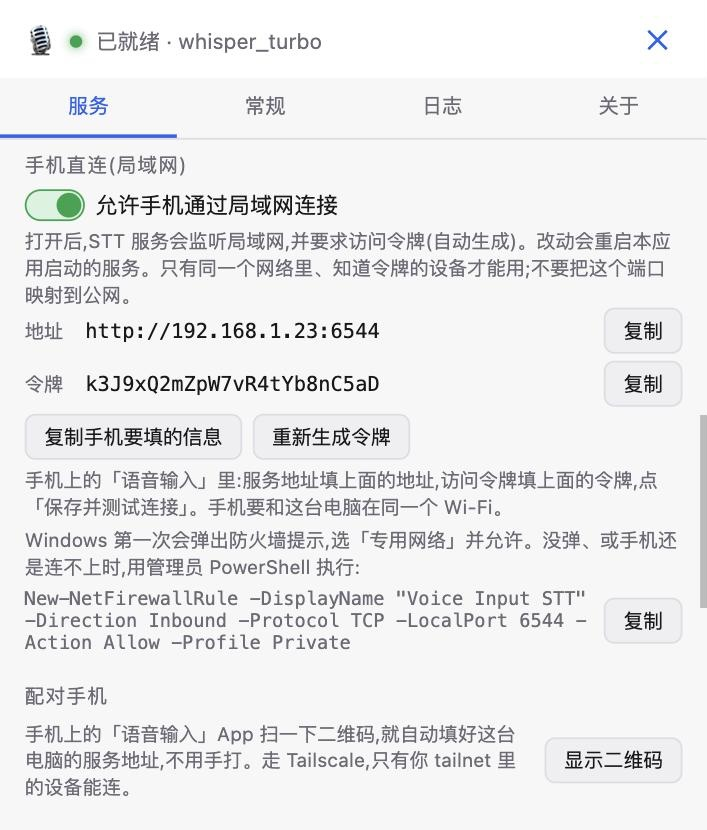

# 测试指南(自己搭服务,自己连)

这份指南写给**帮忙测试的人**:在自己的 Windows 电脑上装桌面客户端、自己跑语音识别服务,
再让自己的 Android 手机连回这台电脑。**全程用你自己的电脑和手机,不需要连任何别人的服务器,
音频也只会发到你自己的电脑。**

> 本文只覆盖 Windows + Android。macOS / Linux / iOS 的安装在 [README](../README.md) 和
> [mobile/README.md](../mobile/README.md) 里。

## 先看这几点

- 这是**测试版**:可能有 bug,欢迎报。反馈怎么写见文末。
- 需要的东西:一台 **Windows 10/11 (64 位)** 电脑;一部 **Android 10 及以上**的手机;
  电脑和手机在**同一个 Wi-Fi** 下(见「手机连电脑」)。
- **第一次启动要下载模型**,体积从几百 MB 到几个 GB,看选哪个模型;LLM 后处理(可选)更大。
  请留足磁盘和时间,有 NVIDIA 显卡会快很多,没有也能用(纯 CPU 会慢一些)。
- 手机输入法是**纯语音键盘**:只有麦克风、空格、退格、回车。要打字时切回你平时的键盘。

## 一、Windows:桌面客户端 + 服务端

### 1. 装客户端

1. 到 [Releases](https://github.com/3F3Feng/voice-input-framework/releases/latest) 下载
   `GUI-Windows-<版本>-x64.exe`(约 5 MB,是安装器)。**别下 `GUI-Python-…`**,那是已弃用的旧客户端。
2. 运行它。没有代码签名的话 Windows 会弹 SmartScreen「已保护你的电脑」:点
   **「更多信息」→「仍要运行」**。

### 2. 建服务端环境

**最省事的办法(2.7.0 起)**:装好 [Git](https://git-scm.com/download/win)(PowerShell 里
`winget install --id Git.Git -e --source winget` 也行),打开客户端,首启向导选「在本机跑模型」,
在「准备本机服务」那一步点 **「下载并安装」**——客户端会把代码下载到 `C:\Users\<你>\voice-input-framework`
并装好依赖(几分钟到十几分钟,进度就显示在按钮下面),不用碰命令行。装完直接看下面的第 3 步。
这条路是新的,**哪一步卡住、提示看不懂,请原样告诉我们**。

想自己在终端里装也可以:

1. 装 [Git](https://git-scm.com/download/win)。
2. 打开 PowerShell:

   ```powershell
   git clone https://github.com/3F3Feng/voice-input-framework.git
   cd voice-input-framework
   powershell -ExecutionPolicy Bypass -File scripts\setup-env.ps1
   ```

   脚本会探测硬件(有 NVIDIA 显卡选 CUDA,否则 CPU),用 [uv](https://docs.astral.sh/uv/) 把依赖装进
   仓库下的 `.venv`,没有 uv 会先装上。需要 Python 3.11 或 3.12,uv 会自己准备。
3. 不用加任何参数:语音识别和 LLM 后处理要的东西都会装上(包括 llama.cpp——有 NVIDIA 显卡装
   CUDA 版,约 500 MB)。脚本最后会说 llama.cpp 用的是哪一种(cuda / vulkan / cpu)——
   **请把这一行告诉我们**。模型要等第一次用到时才下载。

### 3. 启动并验证

1. 打开客户端 →「设置 → 服务」→ 选 **「本地管理」** → 点「自动探测」(找到仓库和 `.venv`)→ 点「启动」。
   第一次启动会下载模型,日志在「设置 → 日志」里看。
2. 在国内网络下载慢的话,同一页的「模型下载源」可选 **hf-mirror.com**(只在国内网络选它)。
3. 状态变成「已就绪」后,**按住 `Ctrl+Alt` 说话,松开**,文字会被输入到当前光标所在的窗口
   (比如记事本)。也可以在主界面按住麦克风按钮。
4. 「设置 → 服务」里有「环境体检」:逐项检查 Python、依赖和加速后端,有问题会给出修复命令。

### 4. 测试还没发布的改动(开发分支)

我们请你试某个还没发布的改动时,会告诉你一个分支名(比如 `feat/next-2.7`)。2.7.0 起不用碰命令行:

1. 「设置 → 服务 → 服务版本」→ 点开 **「参与测试:切换服务代码的分支」**。
2. 「读取分支列表」→ 选那个分支 →「切换」。客户端会把本机的服务代码切过去、重新装依赖、重启服务,
   进度显示在下面。
3. 测完点黄字旁边的 **「切回 main」** 回到正式版。

只换服务端代码,客户端还是你装的那个版本。如果某个改动同时需要新的客户端,我们会另外给安装包。

## 二、让手机连到这台电脑

在桌面客户端里**打开一个开关**就行,不用在终端里设环境变量,也不用自己生成令牌:

1. 「设置 → 服务」→ 选 **「本地管理」**。
2. 找到 **「手机直连(局域网)」**,打开 **「允许手机通过局域网连接」**。
3. 客户端会自动做三件事:让 STT 服务监听局域网;**生成一个随机的访问令牌**;重启本应用拉起的服务
   (稍等几秒,顶部会提示「已重启 LLM 服务 / 已重启 STT 服务」)。
4. 界面里会显示手机要填的**地址**和**令牌**,点 **「复制手机要填的信息」** 发到手机上。



> 图里的地址和令牌是示例。

- **Windows 防火墙**:第一次监听时会弹窗,选**「专用网络」→ 允许访问**。没弹窗,或手机还是连不上,
  界面里有一条 PowerShell 命令(在同一个面板里,带「复制」按钮),用**管理员** PowerShell 执行一次。
- **没显示地址?** 说明客户端没找到这台电脑的局域网地址(比如同时开着 VPN)。在 PowerShell 里运行
  `ipconfig`,看当前网卡的 **IPv4 地址**(形如 `192.168.1.23`),手机里填 `http://<那个地址>:6544`。
- **换令牌**:怀疑令牌泄露、或想让之前配过的手机失效时,点「重新生成令牌」,手机里要重填。
- **关掉开关**:服务恢复成只监听本机、不设令牌。
- **只有同一个网络里、知道令牌的设备**才能用。**不要**把 6544 端口映射到公网。
- 手机不需要 CORS 设置:那只管浏览器,原生应用不受限制。手机只连 STT 服务(端口 6544),
  LLM 服务始终只监听本机,STT 服务自己转发给它。

<details>
<summary><b>高级:不用客户端的开关,自己在终端里启动服务</b></summary>

如果你想自己管服务(比如不用「本地管理」),先停掉客户端里拉起的服务,再在仓库目录的 PowerShell 里:

```powershell
# 生成一个随机令牌(记下来,手机上要填同一个)
$token = -join ((48..57) + (65..90) + (97..122) | Get-Random -Count 24 | ForEach-Object { [char]$_ })
$token

$env:VIF_STT_HOST = "0.0.0.0"     # 允许局域网连接
$env:VIF_API_TOKEN = $token       # 没有令牌就不要开放到局域网
uv run python -m services.stt_server
```

服务设了令牌后,客户端的「本地管理」不会带这个令牌,会被拒。让客户端也连过去:
「设置 → 服务」→ **「远程连接」**→ 地址 `127.0.0.1`、端口 `6544`、填上**同一个令牌**。
防火墙的放行命令见上面。

</details>

## 三、Android 手机

### 1. 安装

- 到 [Releases](https://github.com/3F3Feng/voice-input-framework/releases) 里找标签以 `mobile-v` 开头的版本,
  下载 `voice-input-android-<版本>.apk`(旁边有 `.sha256` 文件可以校验)。
- 浏览器或文件管理器打开 APK,按提示允许**「安装未知应用」**。

### 2. 三步启用

打开「语音输入」应用,按上面三步走:**授权麦克风 → 在系统设置里启用本键盘 → 切换到它**。

### 3. 填服务地址

在应用的「识别服务」里,填**上一节客户端里显示的**地址和令牌:

- **服务地址**:`http://192.168.1.23:6544`(换成客户端里显示的;只填 `192.168.1.23` 也行,会自动补成这样)
- **访问令牌**:客户端里显示的那一串
- 点**「保存并测试连接」**,应该显示 `✓` 加模型名。

### 4. 使用

- 在任意输入框里切到「语音输入」键盘(长按 🌐 选)。
- **点一下麦克风开始,再点一下结束**;或者**按住说话,松手结束**。结果会直接插进输入框。
- 顶部一排按钮选识别语言(自动 / 中 / EN / 粤 / 日 / 한)。
- 录音中点「取消」放弃这一段;没在录音时点「重插」再插一次上一条结果。

> 二维码配对(桌面客户端「配对手机」)**只适用于走 Tailscale 的 https 地址**。局域网里的 `http://` 地址没有这个功能,
> 按上面手填即可。

## 四、要测什么

不用全测,挑你方便的。**每一项的结果(通过 / 不通过 / 怎么不对)都有价值。**

**Windows 客户端**

| | 检查项 |
|---|---|
| ☐ | 安装器能运行;装好后能启动 |
| ☐ | 「设置 → 服务」自动探测能找到仓库和 `.venv`;「启动」后状态变成「已就绪」 |
| ☐ | 「手机直连(局域网)」开关:打开后服务自动重启,界面显示地址和令牌;关掉后恢复只听本机 |
| ☐ | 「重新生成令牌」后,手机里填旧令牌会被拒、填新令牌能连上 |
| ☐ | 按住 `Ctrl+Alt` 说话、松开,文字出现在记事本里 |
| ☐ | 改成「按一下开始、再按一下结束」(设置 → 常规 → 录音方式)也正常 |
| ☐ | 录音中按 Esc 能放弃这一段 |
| ☐ | 中文、英文、中英混说都能识别(换语言试试) |
| ☐ | 切换 STT 模型(设置 → 服务 → STT 模型)能成功 |
| ☐ | 首次启动 / 切换模型要下载时,主界面和下拉框下面能看到「正在下载模型… X / 约 Y(百分比)」在动 |
| ☐ | **有独立显卡的请看**:默认的 STT 模型应该是「Qwen3-ASR-0.6B 量化版」(显存 11GB 以上是 1.7B)。说几句中文和中英混说,准不准、说完到出字几秒?任务管理器里显存占了多少? |
| ☐ | 全新的电脑(没下载过代码):向导里「下载并安装」能一路走到「环境检查 通过」 |
| ☐ | 「服务版本 → 参与测试:切换服务代码的分支」:能读出分支列表;切到我们指定的开发分支后服务正常重启;「切回 main」也正常 |
| ☐ | 托盘图标、最小化、退出都正常;开机自启开关有效 |
| ☐ | LLM 后处理开关能开,开了之后结果带标点、更通顺 |
| ☐ | 「设置 → 服务 → STT 模型」下面那行「这台机器的配置(…)」写的显卡和显存对不对;默认的模型是不是它说的那个 |
| ☐ | **有 NVIDIA 显卡的请看**:「设置 → 服务」里 LLM 那一行有没有「模型跑在 CPU 上」的黄字;没有就是跑在显卡上。说完一句话到出字大概几秒? |

**Android 输入法**

| | 检查项 |
|---|---|
| ☐ | 三步启用顺畅(哪一步不清楚请写下来) |
| ☐ | 「保存并测试连接」成功;令牌填错时提示得明白 |
| ☐ | 点一下开始 / 再点一下结束都能出字 |
| ☐ | 按住说话、松手也能出字 |
| ☐ | 说到一半关掉 Wi-Fi 再恢复,松手后仍能出结果(断线会整段重传) |
| ☐ | 「取消」「重插」「回车」(搜索 / 发送 / 前往会变文字)正常 |
| ☐ | 换识别语言后下一次听写用的是新语言 |
| ☐ | 深色模式下界面看得清 |
| ☐ | 在微信、浏览器、备忘录等不同应用的输入框里都能插入文字 |

## 五、怎么反馈问题

到 [Issues](https://github.com/3F3Feng/voice-input-framework/issues/new/choose) 新建一个「测试反馈」。请带上:

1. **你的环境**:Windows 版本、有没有 NVIDIA 显卡;Android 手机型号和系统版本;客户端版本号
   (「设置 → 关于」)。
2. **你做了什么、期望什么、实际怎么了**。能复现的话写下步骤。
3. **日志**:
   - 桌面客户端:「设置 → 日志」→「复制诊断信息」,粘进 Issue。应用崩溃过的话,下次启动会提示
     「上次异常退出」,同样可以复制诊断信息。
   - 服务端:你运行服务的那个 PowerShell 窗口里最后的几十行输出。
4. **截图或录屏**(有助于看清界面问题)。

> **发之前请检查:不要把访问令牌、你的公网 IP 贴出来。** 诊断信息里一般不含令牌,但截图里可能有。

## 六、隐私与安全

- 音频只会发到**你自己电脑上**的服务,识别在你的电脑上完成。本项目没有任何云端后端。
- 服务一旦对局域网开放,**同一个网络里的人都能连**,所以一定要有令牌。客户端的「手机直连」开关会自动生成并强制使用一个随机令牌;
  自己在终端里起服务时(`VIF_STT_HOST=0.0.0.0`)必须自己设 `VIF_API_TOKEN`。
  **不要**把 6544 端口映射到公网;出门在外想用的话,推荐 [Tailscale](https://tailscale.com/)。
- 令牌以明文存在手机应用的私有目录里,手机上的其它应用读不到。

## 常见问题

**手机测试连接失败**
- 手机和电脑是不是同一个 Wi-Fi?有些路由器的「客人网络」或「AP 隔离」会让设备互相访问不了。
- 客户端里「手机直连(局域网)」的开关是开着的吗?服务有没有在「设置 → 服务」里显示「运行中」?
  (开关刚打开时服务会重启几秒。)
- 手机里填的地址、令牌和客户端里显示的一模一样吗?(令牌区分大小写。)
- Windows 防火墙有没有放行 6544(见上面的 `New-NetFirewallRule` 那条命令)?

**第一次启动很久没反应**:在下载模型。看「设置 → 日志」里 STT 的输出。

**识别结果的语言不对**:在键盘顶部或应用里把「自动」改成具体的语言。

**别的问题**:去 Issues 里搜一下,或者新建一个。
